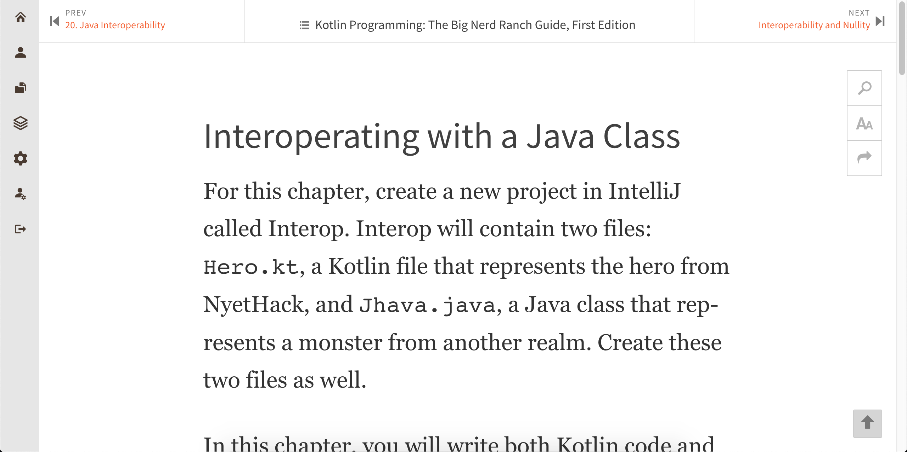

Makes Safari Books Online eye friendly.

All credit for this goes to [mmizutani](https://github.com/mmizutani/userstyles-safari-books-online). I just took the css from their file, fixed some things that were preventing it from working, and made this a chrome extension instead of using userstyles.

Before:  

After:  

